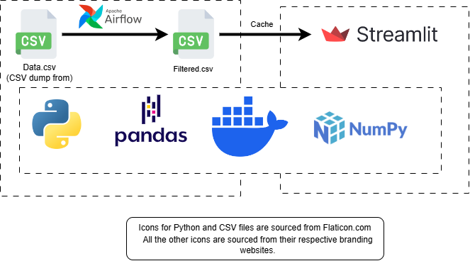

# Better Snack - README

## Overview

**Better Snack** is a Streamlit application that helps users find and evaluate snack products based on their names and brands. It utilizes fuzzy matching algorithms to enhance product name recognition and allows filtering by brand for more precise results.

## Live Application

You can access the Better Snack application [here](https://bettersnack.streamlit.app/).

## System Design




## Technologies Used

- **Streamlit**: A framework for building interactive web applications in Python, enabling rapid development of data-driven apps.
- **RapidFuzz**: A library for fuzzy string matching that helps compare product names and brands efficiently.
- **Pandas**: A powerful data manipulation and analysis library for Python, used for handling the product dataset.
- **NumPy**: A library for numerical computing in Python, providing support for large, multi-dimensional arrays and matrices.
- **CSV**: Currently, the application reads data from a CSV file (`filtered.csv`). This approach was chosen to practice data engineering principles and challenge the developer's skills.
- **SQLite**: A lightweight database engine that will be used for storing and querying product data in future updates.
- **Docker**: A platform for developing, shipping, and running applications in containers, ensuring consistent environments.
- **Apache Airflow**: A workflow automation tool that will manage data updates and orchestrate ETL processes.


## Features

- **Product Name Lookup**: Users can enter a snack name to find matches in the dataset, utilizing fuzzy string matching for improved accuracy.
- **Brand Filtering**: Optional brand name input to further narrow down search results.
- **Dynamic Visualization**: The application displays relevant product details such as Nova Group, Nutri Score, and Nutri Grade with visually distinct indicators.
- **Caching**: Efficient data loading with caching mechanisms to improve app performance.

## Requirements

To run the application, ensure you have the following Python packages installed:

```bash
pip install streamlit rapidfuzz pandas numpy
```

## Usage

1. **Load the Data**: The application reads the dataset from `Data/Files/filtered.csv`. Ensure this file exists and is properly formatted.
2. **Run the App**: Use the following command to start the Streamlit application:
   ```bash
   streamlit run app.py
   ```
3. **Interact with the App**:
   - Enter a snack name in the provided input field.
   - Optionally, enter a brand name to filter results.
   - The app will display matching products along with relevant nutritional information.

## Docker Support

### Building the Docker Image

To build the Docker image for the application, run the following command in your project directory:

```bash
docker build -t better-snack .
```

### Running the Docker Container

To run the Docker container with the current directory mounted as a volume, use the following command:

```bash
docker run -p 8501:8501 -v $(pwd):/app better-snack
```

- This will allow you to access the app at `http://localhost:8501` in your web browser.

## Code Structure

- **Functions**:
  - `load_data()`: Loads and caches the product data from a CSV file.
  - `lookupProductName()`: Finds products matching the input name using fuzzy matching.
  - `filterBrand()`: Filters the resulting products by the specified brand name.
  - `lookupBestMatch()`: Identifies the best match from the filtered results.
  - `printRow()`: Displays the product information in a formatted way on the Streamlit app.

## Incoming Updates

### Transition to SQLite

- **Database Integration**: The application will be updated to use SQLite for storing product data. This will enhance data retrieval efficiency and allow for more complex queries.

### Containerization with Docker

- **Docker Support**: Future updates will include Docker support, allowing users to easily deploy the application in isolated environments. This ensures that all dependencies are packaged together, reducing compatibility issues.

### Data Updates with Apache Airflow

- **Workflow Automation**: Apache Airflow will be integrated to manage and schedule data updates. This will allow for automated ETL (Extract, Transform, Load) processes, ensuring that the product data is consistently up to date.

## Contribution

Contributions to improve the application are welcome! Feel free to fork the repository and submit a pull request with enhancements or bug fixes.

## License

This project is licensed under the MIT License - see the [LICENSE](LICENSE) file for details.

---

For any questions or issues, please feel free to reach out! Enjoy discovering your snacks!